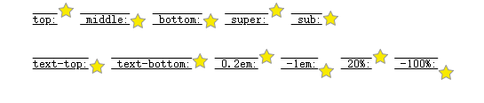
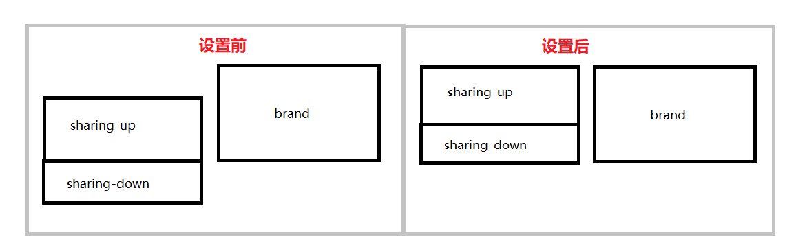

# css

## vertical-align

- 属性值：baseline | sub | super | text-top | text-bottom | middle | top | bottom | `<percentage>` | `<length>`
   - baseline：使元素的基线与父元素的基线对齐。
   - sub:使元素的基线与父元素的下标基线对齐。
   - super:使元素的基线与父元素的上标基线对齐。
   - text-top:使元素的顶部与父元素的字体顶部对齐
   - text-bottom:使元素的底部与父元素的字体底部对齐
   - middle：使元素的中部与父元素的基线加上父元素x-height(x高度)的一半对齐
   - `<length>`:使元素的基线对齐到父元素的基线上的给定长度。可以是负数
   - `<percentage>`使元素的基线对齐到父元素的基线智商的给定百分比，该百分比是`line-height`属性的百分比。可以是负数
   - **相对行的值**
   - 下列值使元素的相对正行垂直对齐
   - top:使元素及其后代元素的顶部与整行的顶部对齐
   - bottom:使元素及其后代的底部与整行的底部对齐
   - 没有基线的元素，使用外边距的下边缘替代
   - 
- 案例：
   - 问题：`sharing`里面的子标签 一直无法跟`brand`对齐,当只有一个`sharing-up`子标签的时候，就可以对齐，当`sharing-up`跟`sharing-down`一起出现的时候，`sharing-down`的底部直接往下撑开，上面差一点，下面出一点（就像下图设置前一样）

```html
 <div class="list">
    <div class="sharing">
       <div class="sharing-up"></div>
       <div class="sharing-down"></div>
    </div>
    <div class="brand"></div>
 <div> 
```
- 解决方法：在它们的父标签 `list` 添加样式 `vertical-aling:top;` 顶部对齐~

- 

## -webkit-overflow-scrolling(属性控制元素在移动设备上是否使用滚动回弹效果)
  - 属性值：auto | touch
    - auto:使用普通滚动, 当手指从触摸屏上移开，滚动会立即停止
    - touch：使用具有回弹效果的滚动，当手指从触摸屏上移开，内容会继续保持一段时间的滚动效果。继续滚动的速度和持续的时间和滚动手势的强烈程度成正比

- 在移动端上，在你用overflow-y:scorll属性的时候，你会发现滚动的效果很木，很慢，这时候可以使用-webkit-overflow-scrolling:touch这个属性，让滚动条产生滚动回弹的效果，就像ios原生的滚动条一样流畅。


  ```css
     {
     overflow-y:auto;
     -webkit-overflow-scrolling: touch;
     } 
   ```
## rem
  - em
     - 概念:1em和当前字体大小相等。是一个相对单位。如果没有设置，那就用在浏览器中默认的文字大小是16px。因此，1em的默认大小是16px。
     - 特点:em的值并不是固定的，em会继承父级元素的字体大小
  - rem(root em)
     - 概念：rem也就是在html里面设置一个根字体，然后在用js动态获取设备当前可视区的宽度，在跟设计图做一个除法，最后得出px等于多少rem
     - 例子：
     1. 给页面设置的根字体为20px,假定设计图给我的640px
     2. 给页面设置的跟字体为20px,假定设计图给我的750px
     ```js
       1、 20*document.documentElement.clientWidth / (640/2) = 当前页面根字体大小px
       2、 20*document.documentElement.clientWidth / (750/2) = 当前页面根字体大小px
     ```
  - 为什么要用rem
    - 屏幕大小不一样，有的320px,有的640px,如果写固定px的话，那么要么小的放不下，要么大的有大片空白，使用rem就可以解决这样的情况
  - 用rem 还是 em 
     - 应该是结合使用em和rem。当属性值的大小需要根据当前元素字体尺寸缩放时，就选用em，其它的情况都使用更简单的rem。

# Vue

## 品牌认证显示(v-if)
- 品牌认证是否显示取决于后端的 level 值，当 level 值为2的时候，显示品牌认证的 `img` 图片，当 level 值不等于2的时候，就不显示,需求是认证的显示，那就要这么做
```html
  
```
- 认证是 `level === "2"` 的时候显示，在 控制台里面的 `Network` 里面的 `XHR` 里面的 `name` 找到了接口，在`data`里面找到了 level 值，然后 `v-if="item.brand.level ==='2'"` ，图片就会当 `level` 为 2 的时候显示，否则就隐藏


## 混入
- 基础
   - 混入提供了一种方式，来分发Vue组件中的可复用功能。一个混入对象可以包含任意组件选项。当组件使用混入对象时，所有混入对象的选项将被‘混合’进入改组件本身的选项。
- 深入了解混入概念：https://cn.vuejs.org/v2/guide/mixins.html
- 案例
- 把外部 js 里面的方法对象混入到组件里面
```html
 
```

- 这个的意思就是在 `Js/mixin.js` 调用 `openApp` 功能 
 ```js
 import { openApp } from 'Js/mixin.js'
 ```
- 还要在 `export default` 对象里面写上`openApp`混入对象
```
mixins:[openApp]
```
- 由于调用了openAppDate,所以我们要在我们自己的组件里面的 `computed` 计算属性定义一下
```js
  computed: {
		openAppData() {
			return this.$store.state.openApp
		}
	},
```


